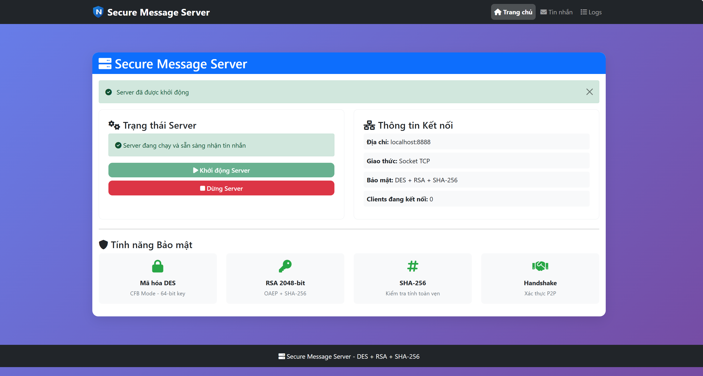
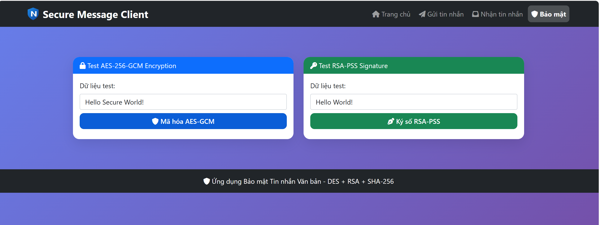

<h1 align="center">ỨNG DỤNG BẢO MẬT TIN NHẮN VĂN BẢN</h1>

<p align="center">
  
  
</p>

<div align="center">

[](https://dainam.edu.vn/vi/khoa-cong-nghe-thong-tin)
[](https://dainam.edu.vn)

</div>


## 🎯 Giới thiệu bài toán
Dự án không chỉ dừng lại ở việc cài đặt các thuật toán mật mã cơ bản, mà tập trung vào Secure System Upgrade Challenge – nâng cấp hệ thống hiện có để đạt chuẩn bảo mật thực tế. Cụ thể, chúng tôi đã thay thế hoàn toàn chuẩn DES lỗi thời bằng **AES-256-GCM** để đảm bảo đồng thời tính bí mật và xác thực dữ liệu. Hệ thống còn được gia cố bằng chữ ký số **RSA-PSS** an toàn hơn và triển khai cơ chế chống Replay Attack bằng định danh msg_id (UUID), chặn đứng hành vi phát lại các gói tin cũ.

## 🔒 Tính năng Bảo mật

- **Mã hóa AES-256-GCM**: Sử dụng chuẩn mã hóa có xác thực (AEAD) thay thế DES, đảm bảo đồng thời tính bí mật và toàn vẹn của dữ liệu.

- **Chữ ký số RSA-PSS**: Nâng cấp lên chuẩn RSA-PSS an toàn hơn, giúp xác thực danh tính người gửi và chống giả mạo chữ ký.

- **Chống Replay Attack**: Triển khai định danh tin nhắn (msg_id) kết hợp bộ lọc tại Server để chặn đứng việc gửi lại các gói tin cũ.

- **Công cụ kiểm thử tự động**: Tích hợp bộ giả lập tấn công (Replay & Tampering) ngay trên UI để xác thực cơ chế phòng thủ của hệ thống.

## 📂 Cấu trúc Thư mục
```
btlN/
├── client_app.py          # Flask app cho client
├── server_app.py          # Flask app cho server
├── crypto_utils.py        # Thư viện mã hóa (DES, RSA, SHA-256)
├── socket_client.py       # Client socket để gửi tin nhắn
├── socket_server.py       # Server socket để nhận tin nhắn
├── run_both.py           # Script chạy 
cả client và server
├── test_secyrity.py      # test giả tấn công
├── requirements.txt      # Dependencies
├── templates/            # HTML templates
│   ├── client_base.html
│   ├── client_index.html
│   ├── client_send.html
│   ├── client_receive.html
│   ├── server_base.html
│   ├── server_index.html
│   └── server_messages.html
└── static/              # CSS, JS files
```

## 🚀 Cài đặt

1.  Clone repository:
- bashgit clone <repository-url>.
- cd BTL.

 2. Cài đặt dependencies:
  ```bash
  pip install -r requirements.txt
  ```

## 🎮 Chạy ứng dụng
### Khởi động Server và Client cùng lúc

1. Sử dụng script run_both.py để chạy cả server và client cùng lúc:python run_both.py
2. Server sẽ chạy tại: http://localhost:5001
3. Client sẽ chạy tại: http://localhost:5000

- **Hướng dẫn:**
1. Truy cập http://localhost:5001 để khởi động server socket.
2. Truy cập http://localhost:5000 để gửi/nhận tin nhắn.
3. Nhấn Ctrl+C để dừng cả hai ứng dụng.


### Khởi động riêng lẻ

1. Khởi động Server: **python server_app.py**

 - Server sẽ chạy tại: http://localhost:5001

2. Khởi động Client:**python client_app.py**

- Client sẽ chạy tại: http://localhost:5000

**Lưu ý:** Đảm bảo server được khởi động trước khi chạy client.


### 🌐 Sử dụng

1. Khởi động Server:
- Truy cập http://localhost:5001 và nhấn "Khởi động Server" để kích hoạt server socket.**


2. Gửi tin nhắn:

- Truy cập http://localhost:5000. Vào trang "Gửi tin nhắn" và nhập nội dung tin nhắn, sau đó gửi.


3. Nhận tin nhắn:

- Vào trang "Nhận tin nhắn" tại http://localhost:5000 để xem tin nhắn đã được giải mã.


4. Kiểm tra bảo mật:

- Vào trang "Bảo mật" tại http://localhost:5000 để test các thuật toán mã hóa ( AES-256-GCM, chữ ký số).


## ✨ Các Chức Năng Của Bài

### 1. Gửi và Nhận Tin Nhắn An Toàn (Nâng cấp với AES-256-GCM):

- Nội dung tin nhắn được bảo mật bằng chuẩn AES-256-GCM (thay thế cho DES), cung cấp khả năng mã hóa có xác thực (AEAD) để đảm bảo đồng thời tính bí mật và toàn vẹn dữ liệu.
- Tin nhắn được giải mã và hiển thị an toàn tại trang "Nhận tin nhắn" sau khi xác thực thành công.


 ### 2. Xác Thực và Trao Đổi Khóa (Chuẩn RSA-PSS):

- Hỗ trợ handshake P2P giữa Client và Server để thiết lập phiên làm việc an toàn.
- Khóa phiên (Session Key) được bảo vệ bằng chuẩn ký số RSA-PSS (nâng cấp từ RSA PKCS#1 v1.5), đảm bảo an toàn tuyệt đối trong quá trình trao đổi khóa.


 ### 3. Kiểm Tra Tính Toàn Vẹn & Chống Replay Attack:

- Loại bỏ hàm băm SHA-256 thuần túy, thay thế bằng cơ chế Authentication Tag tích hợp trong AES-GCM để tự động phát hiện mọi can thiệp (Tampering).
- Triển khai định danh tin nhắn duy nhất (msg_id) và danh sách lưu vết nonce tại Server để chặn đứng hoàn toàn các cuộc tấn công phát lại (Replay Attack).


### 4. Kiểm Thử Bảo Mật Tự Động (Security Tester):
- Tích hợp bộ công cụ kiểm thử tự động ngay trên giao diện Web (Security UI).
- Cho phép giả lập các kịch bản tấn công (Tampering & Replay) để kiểm chứng khả năng phòng thủ của hệ thống với kết quả hiển thị trực quan (PASSED/FAILED).


### 5. Quản Lý Server & Giám Sát:

- Điều khiển server (khởi động/dừng) và theo dõi trạng thái kết nối thời gian thực qua Web API.
- Hiển thị danh sách Client và lịch sử giao tiếp trên Server với dữ liệu đã được lọc an toàn.


### 6. Ghi Nhận Log Bảo Mật:

- Hệ thống ghi log chi tiết các sự kiện quan trọng (Handshake, xác thực, tấn công).
- Cải tiến định dạng log giúp gỡ lỗi nhanh chóng mà vẫn đảm bảo an toàn, tuyệt đối không lưu khóa bí mật hoặc dữ liệu thô nhạy cảm.


## 📡 API Endpoints
### Client API

- GET / - Trang chủ client
- GET /send - Trang gửi tin nhắn
- GET /receive - Trang nhận tin nhắn
- POST /api/send-message - Gửi tin nhắn
- POST /api/receive-message - Nhận tin nhắn
- POST /api/test-des - Test mã hóa DES
- POST /api/test-rsa - Test chữ ký RSA
- POST /api/test-sha256 - Test hash SHA-256

### Server API

- GET / - Trang chủ server
- GET /messages - Quản lý tin nhắn
- GET /logs - Xem logs
- POST /api/start-server - Khởi động server socket
- POST /api/stop-server - Dừng server socket
- GET /api/server-status - Trạng thái server
- GET /api/connected-clients - Danh sách clients
- GET /api/server-logs - Logs server

## 🔐 Bảo mật

 - ✅ AES-256-GCM Encryption: Sử dụng chuẩn mã hóa có xác thực (AEAD) thay thế cho DES, cung cấp tính bảo mật cao và tự động kiểm tra tính toàn vẹn dữ liệu thông qua Auth Tag.
 - ✅ RSA-PSS 2048-bit: Sử dụng chuẩn ký số RSA-PSS hiện đại (nâng cấp từ PKCS#1 v1.5) để xác thực danh tính và trao đổi khóa phiên (Session Key) an toàn.
 - ✅ Anti-Replay Protection: Cơ chế định danh tin nhắn (msg_id) kết hợp lưu vết nonce tại Server giúp loại bỏ hoàn toàn nguy cơ bị tấn công phát lại (Replay Attack).
 - ✅ Integrity & Tampering Detection: Tích hợp xác thực dữ liệu ngay trong quá trình giải mã, giúp hệ thống phát hiện tức thời mọi hành vi can thiệp (Tampering) vào gói tin trên đường truyền.
 - ✅ Secure Handshake: Xác thực phiên làm việc hai chiều qua Socket TCP, sử dụng khóa dẫn xuất từ HKDF để đảm bảo khóa phiên không bao giờ lộ ra ngoài dưới dạng thô.

## ⚠️ Lưu ý

- ❌ Đây là ứng dụng demo phục vụ mục đích học tập và nghiên cứu.

-   ❌ Các thuật toán đã được nâng cấp lên chuẩn hiện đại (AES-256-GCM, RSA-PSS).

- ❌ Khuyến nghị sử dụng các giải pháp bảo mật chuyên dụng trong môi trường thực tế.

- ❌ Đảm bảo Server luôn ở trạng thái sẵn sàng trước khi Client thực hiện kết nối.

## 🖥️ Giao diện và hoạt động

### Trang Server
1. **Trang chủ**
  

2. **Trang Quản lý tin nhắn**
  

3. **Trang Logs**
  

### Trang Client
1. **Trang chủ**
  

2. **Trang Gửi tin nhắn**
  

3. **Trang nhận tin nhắn**
  

4. **Trang bảo mật**
  

  © 2026 NHÓM 1, CNTT18-02, TRƯỜNG ĐẠI HỌC ĐẠI NAM
